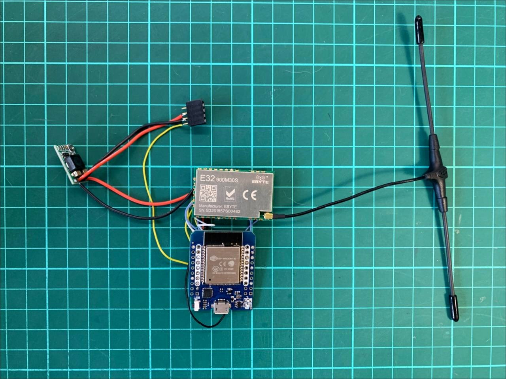
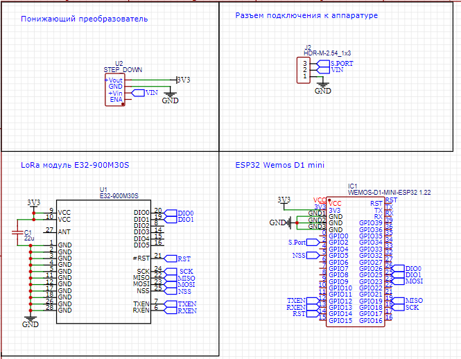
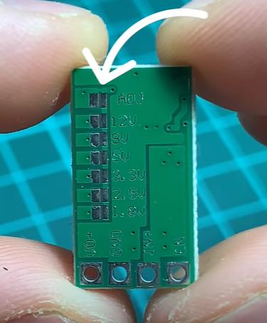
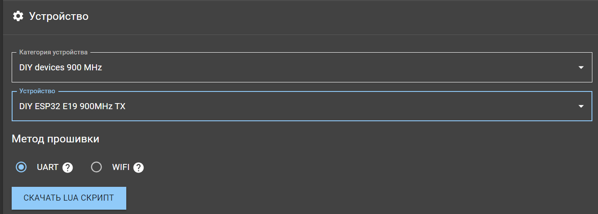

# DIY ELRS 900MHz Передатчик с мощностью до 1000mW 

Передатчик можно собрать без платы навесным монтажем, либо спроектировать плату с помощью любой подходящей для этого программы, например, EasyEDA. 
  
  Ссылка на проект в EasyEDA - [EasyEDA_ELRS_TX](https://easyeda.com/editor#project_id=af067bf24880471aa657eca3477f4bab) (пока нет готовой платы, можно создать свою)

# Схема
    
#### На понижающем преобразователе необходимо перерезать дорожку и запаять перемычку на 5В
    
  
# Прошивка
Прошить можно с помощью программы [ExpressLRS Configurator](https://github.com/ExpressLRS/ExpressLRS-Configurator/releases). Выбираем Категорию устройства -  **DIY devices 900 MHz** Устройство - **DIY ESP32 E19 900MHz TX**  
  
Метод прошивки **UART**, вбиваем свою бинд фразу, выбираем FCC_915 домен, подключаем ESP32 к компьютеру и прошиваем!
___
Разблокировать полную мощность можно с Wi-Fi страницы передатчика. Для этого необходимо поставить галочку **UNLOCK_HIGHER_POWER** 
# Ссылки на комплектующие 
* [EBYTE E32-900M30S](https://aliexpress.ru/item/1005003505199724.html?sku_id=12000026091105071)
* [ESP32](https://aliexpress.ru/item/32858054775.html?sku_id=12000021656141439&spm=a2g2w.productlist.search_results.0.638c15d3m10jme)
* [DC-DC StepDown](https://aliexpress.ru/item/32801569565.html?sku_id=12000037978311750&spm=a2g2w.productlist.search_results.11.50754011WHtevf) 