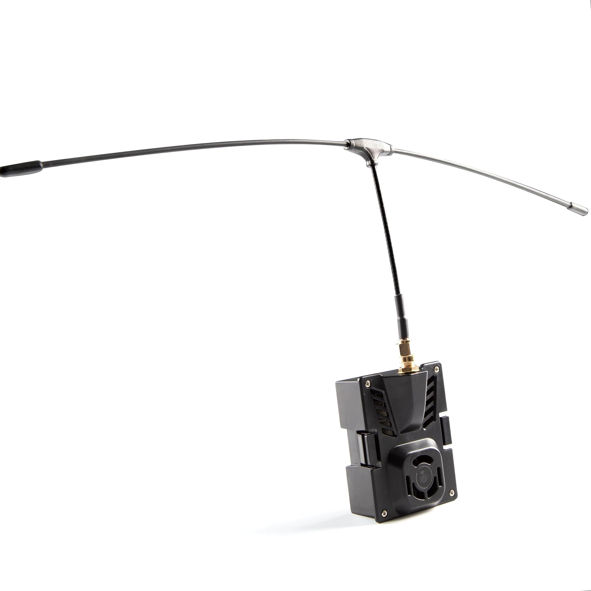
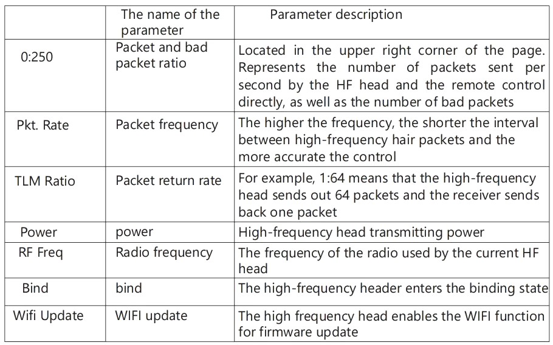
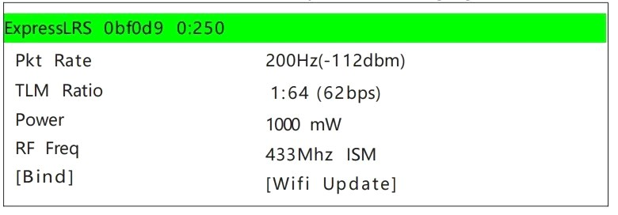

### General Information

#### Report Item: ELRS Nano 433 RX

- **Firmware Name:** 433nano RX
- **Type:** FCC
- **Antenna Interface:** IPEX1
- **Maximum Refresh Rate for Reception:** 500Hz
- **Minimum Refresh Rate for Reception:** 25Hz
- **Working Voltage:** 4-5.5V
- **Weight:** 0.51 grams
- **Receiver Size:** 20mm x 11mm x 3mm
- **Working Contract:** CRSF (Betaflight)
- **Antenna Size:** 315mm x 97mm (There is a 1-3cm error in manual measurement)

---

### Frequency Steps

1. Please first check the software version number of the latest generation ELRS head or the The integrated ELRS high-frequency head module. Currently, only major version numbers **1.x.x** and **2.x.x** are available. Please confirm that the high-frequency head and receiver are the same major version.
* (If the high-frequency head with software version 2.0.1 and the receiver with software version 2.30 can be used for frequency matching normally, there is no need to update the high-frequency head firmware.)
* However, for better compatibility, it is recommended to update the high-frequency head and receiver to the same software version.

2. If the receiver turns on and off quickly three times, the LED will start flashing twice, indicating that the receiver has entered frequency matching mode. Enter the high-frequency head binding mode.

3. After successful binding, the LED on the receiver will be constantly lit and can also receive telemetry signals.

4. **Receiver LED Status Meaning:**
- **Steady light:** for successful frequency matching or normal communication connection.
- **Double-flashing LED:** for frequency matching.
- **Slow-flashing LED:** unable to receive a signal from the transmitter.
- **Fast-flashing LED:** in Wi-Fi communication mode. At this time, the program can be updated via a computer or mobile phone connection.

---
### ELRS 433MHZ TX

BelinRC ELRS-433-TX, the high-frequency head, is a new generation of wireless remote control developed based on the **ExpressLRS** open source project. The ELRS system features long remote control distance, stable connection, low latency, high refresh rate, and flexible configuration.

**1. Basic Parameters**

- **Frequency Band:** (433MHz/360-560MHz version optional)
- **Output Power:** 100mW/250mW/500mW/1000mW
- **Refresh Rate:** 25Hz/50Hz/100Hz/200Hz
- **Input Voltage:** 5-12V (2S)
- **Main Control IC:** ESP32 + SX1278, ESP8285 Backpack Chip

BelinRC ELRS-433-TX, the high-frequency head, can be used with all remote controls on the market that use the JR interface. (Interface Diagram):

**2. Basic Configuration**

By default, the ELRS-433-TX high-frequency head only accepts Crossfire Serial Data Protocol (CRSF) signals. The remote control's main high-frequency interface must support CRSF signal output. The following example uses the OpenTX remote control system to illustrate how to configure the remote control to generate CRSF signals and use the LUA script to control the ELRS high-frequency head.

**3. CRSF Protocol**

In OpenTX, select **MODELSELECTION** to enter the **MODELSETUP** page, where you can turn off the internal RF (**OFF**), enable the external RF (**External RF**), and set the output mode to **CRSF**. This is shown in the figure below.

If the ELRS-433-TX high-frequency head is connected correctly and the remote control is configured to output CRSF from the external high-frequency head (External RF) as described above, the ELRS high-frequency head can generally be used normally.

**4. LUA Script Manipulation**

If you want to modify the power and refresh rate of the ELRS high-frequency head, you need to use the OpenTX system's LUA script. It is shown below.

- Copy the official LUA script `ELRS.lua` to the remote's SD card (the path is `Scripts/tools`).
- In the OpenTX system, press and hold the **SYS** button (e.g., RadioMaster T8 remote, etc.) or the **MENU** button (e.g., Frsky Taranis X9D remote, etc.) to enter the **SD-HC CARD** interface, select the `ELRS.lua` script, and run it.
- If the LUA script executes successfully, the following figure shows the page.
- Using the LUA script, you can choose to configure parameters such as **Rate**, **Ratio**, and **Power**. The following table describes all the features of the LUA script.

_Note: The official LUA ELR script

-----

# LoRa Review

---

### Speed reading:

-   [LoRa Review](#a1)
-   [How LoRa works](#a2)
-   [Characteristics of LoRa](#a3)
-   [Chip SX1278](#a4)
-   [1. What is the SX1278 chip?](#a5)
-   [2. Semtek SX1278](#a6)
-   [Modular Lora products based on SX1278](#a7)

---

## LoRa Review

**LoRa (Long Range)** is a wireless communication technology designed for long-distance, low-power communication between devices. It's particularly well-suited for **Internet of Things (IoT)** and **machine-to-machine (M2M)** applications. LoRa technology is based on half-duplex modulation and ensures reliable connections through spread spectrum and forward error correction coding.

---

## How LoRa works

1.  **Signal Encoding**: The transmitting device uses forward error correction to encode data, adding redundant information to improve reliability.
2.  **Spread Spectrum Modulation**: The transmitter spreads the signal over a wider frequency band. This distributes the signal's energy, which boosts its immunity to noise.
3.  **Collision Prevention and Access**: LoRa devices use the **ALOHA protocol** to avoid data collisions on the network.
4.  **Network Server**: This server coordinates communication between gateways, processes incoming data, and forwards it to the appropriate application server or cloud platform. It also handles device registration, authentication, and key management.
5.  **Application Server**: This server receives data from the network server and processes it for the application. The data can then be displayed, saved to a database, or used to trigger other actions.
6.  **Reception and Demodulation**: The receiver listens for the signal at a specific frequency and uses a LoRa modem to demodulate it, restoring the original data.
7.  **Direct Error Correction Decoding**: The receiver decodes the demodulated signal to correct any transmission errors.
8.  **Data Extraction**: The valid data is extracted for processing and use.

---

## Characteristics of LoRa

1.  **Long-distance transmission**: LoRa's low-power spread-spectrum modulation allows for long-range communication. It can transmit over greater distances than narrowband modulation with the same power.
2.  **Low energy consumption**: LoRa devices can transmit data in short bursts and then enter a sleep mode, which significantly extends battery life. This is vital for battery-powered IoT devices.
3.  **Large capacity**: LoRa can support a large number of devices simultaneously due to its collision avoidance and multi-channel access technology.
4.  **Strong anti-interference**: The technology is robust in harsh environments. It uses spread-spectrum broadband modulation and forward error correction to resist multi-beam fading, noise, and interference.
5.  **Flexibility**: LoRa can operate on different frequency bands and be customized for specific applications and regional regulations. It uses globally available **ISM frequency bands** like 868 MHz, 915 MHz, and 433 MHz.
6.  **Long-distance communication**: Devices can exchange data over several kilometers, making it suitable for wide-area applications.
7.  **Low data transfer speeds**: LoRa is typically used for low-data-rate applications, such as transmitting small amounts of sensor data.

---

# Chip SX1278

### 1. What is the SX1278 chip?

The **SX1278** is a remote sensing component for **Internet of Things (IoT)** networks. It enables long-distance data communication between devices and sensors, which is valuable for remote monitoring. The chip uses broadband wireless technology for high-frequency, low-latency data transmission. Manufactured by **Semtech**, the SX1278 chip is the core of LoRa wireless communication, supporting multiple frequency bands (e.g., 868 MHz, 915 MHz) for long-range and low-power operations. It integrates LoRa modems, error correction, and spread-spectrum technology for reliable communication. Its frequency range is 0.3 to 4.5 MHz, with a typical range of about 300 meters or 0.3 kilometers.

### 2. Semtek SX1278

-   **Frequency band support**: Supports popular frequency bands like **433 MHz, 868 MHz, and 915 MHz**, making it adaptable for global use.
-   **Long-range transmission**: Utilizes spread-spectrum technology to extend transmission range and improve penetration compared to traditional narrowband modulation.
-   **Low Power Consumption**: Optimized for battery-powered devices, it supports fast entry and exit of low-power modes to extend battery life.
-   **Anti-interference**: Has strong anti-interference capabilities due to its forward error correction and efficient demodulation algorithms.
-   **Multiple communication interfaces**: Provides **SPI** and **GPIO** interfaces to connect with microcontrollers and other devices.
-   **LoRaWAN Compatibility**: It's compatible with the **LoRaWAN protocol**, a low-power wide-area network protocol for device management, security, and data transfer.

The SX1278 is a powerful LoRa RF transceiver chip with long-distance transmission, low power consumption, and strong interference protection, making it a key component for reliable LoRa communication systems.

---

## Modular Lora products based on SX1278

### [E32-DTU(433L30)](http://www.ru-ebyte.com/products/E32-DTU(433L30))

E32-DTU(433L30) SX1278 radio frequency module, Lora 433m antenna communication, radio communication terminal RS485 232.

---

### [E32-433T37S](http://www.ru-ebyte.com/products/E32-433T37S)

E32-433T37S is a new generation Lora wireless module based on the SX1278. It has various transmission methods and operates in the (410–441 MHz) band (default is 433 MHz).

---

### [E32-433T20S](http://www.ru-ebyte.com/products/E32-433T20S)

E32-433T20S is a wireless serial port (UART) module based on the SEMTECH SX1278 RF chip. It has multiple transmission modes and operates in the 410 - 441 MHz frequency range.

---

### [E32-433T33S](http://www.ru-ebyte.com/products/E32-433T33S)

E32-433T33S is a wireless serial port (UART) module based on the SEMTECH SX1278 RF chip.

---

### [E32-400M20S](http://www.ru-ebyte.com/products/E32-400M20S)

E32-400M20S is a LoRaTM SMD 433/470 MHz wireless module independently developed from the SX1278 of the American company Semtech. The maximum transmission power is 1 W.

---

### [E19-433M20S2](http://www.ru-ebyte.com/products/E19-433M20S2)

The E19-433M20S2 is based on SEMTECH's original imported RFIC SX1278 and uses LoRa's spectrum expansion technology. The transmission range is much longer than before, in addition, the power density is more concentrated and the effectiveness of the anti-interference protection is better.

---

### [E19-433M30S](http://www.ru-ebyte.com/products/E19-433M30S)

E19-433M30S 433 MHz Sx1278 Lora IoT receiver module wireless RF transmitter with a range of 10 kilometers based on the original imported RFIC SEMTECH SX1278 using LoRa spread spectrum technology.

---

### [E32-433T20D](http://www.ru-ebyte.com/products/E32-433T20D)

E32-433T20D — wireless serial port module based on Semtech SX1278 radio chip (TTL layer), transparent transmission mode.

---

### [E32-433T20S1](http://www.ru-ebyte.com/products/E32-433T20S1)

E32-433T20S1 — wireless transceiver module based on SEMTECH SX1278 (can be used as both transmitter and receiver). It uses LoRa spread spectrum technology, which significantly improves the module's transmission range and diffraction characteristics compared to traditional FSK.

---

### [E32-433T30D](http://www.ru-ebyte.com/products/E32-433T30D)

The E32-433T30D uses LoRa spread spectrum technology. Thanks to this technology, the module can transmit further than similar products with the same power and has better protection against interference.

---

### [E32-170T30D](http://www.ru-ebyte.com/products/E32-170T30D)

E32-170T30D long-distance wireless modem module based on original imported SEMTECH SX1278 RF chip, transparent transmission, TTL layer available.

---

### [E32-433T20S2T](http://www.ru-ebyte.com/products/E32-433T20S2T)

E32-433T20S2T —is a 100 mW wireless transceiver module based on SEMTECH SX1278, operating frequency 410–441 MHz (default 433 MHz), using LoRa spread spectrum technology. Equipped with FEC (Forecasting Error Correction) algorithm and data encryption and compression features.

---

### [E32-433T20S1](http://www.ru-ebyte.com/products/E32-433T20S1)

The E32-433T20S1 RF transmitter is a SEMTECH SX1278-based wireless transceiver module (can be used as either a transmitter or a receiver). It uses LoRa spread spectrum technology to significantly improve the module's transmission range and diffraction characteristics compared to traditional FSK.

---

### [E32-433T30S](http://www.ru-ebyte.com/products/E32-433T30S)

E32-433T30S Long Distance Remote Control 433MHz The Lora sx1278 Transmission and Reception Module is a wireless SMD module (UART) with an operating frequency of 410-441MHz, equipped with LoRa technology, encryption and data compression.

---

### [E32-400M30S](http://www.ru-ebyte.com/products/E32-400M30S)

E32-400M30S — is a 433/470 MHz proprietary LoRaTM SMD wireless module with a maximum transmission power of 1 W, based on the SX1278 manufactured by the American company Semtech.

---

### [E32-400T20S3](http://www.ru-ebyte.com/products/E32-400T20S3)

The E32 series is a wireless UART module based on the SEMTECH SX1276/SX1278 RF IC with transparent transmission and LoRa spread spectrum technology. The module has a 3.3 V TTL output. The SX1276/SX1278 supports LoRa™ technology. LoRaTM DSSS (Direct Sequence Spread Spectrum) technology provides long range, reliable anti-interference protection and strict data confidentiality.

---

### [E22-230T22S](http://www.ru-ebyte.com/products/E22-230T22S)

The E22-230T22S has multiple transmission modes and an operating frequency range of 220.125–236.125 MHz. With the new extended LoRa spectrum, the transmission distance is increased, the power consumption is lower, the size is smaller than the SX1278, and it supports WOR, wireless configuration, carrier definition, and relay network function.

---

### [E32-433T20DT](http://www.ru-ebyte.com/products/E32-433T20DT)

E32-433T20DT — is a wireless transceiver module based on SEMTECH SX1278 (can be used as either a transmitter or a receiver). Thanks to LoRa's spread spectrum technology, the module's transmission range and penetration capacity are more than doubled compared to traditional FSK.

---

### [E19-433M20SC](http://www.ru-ebyte.com/products/E19-433M20SC)

E19-433M20SC LoRa Module Spi 20 dBm 433 MHz Long Distance Wireless Transceiver RF Module Based on Original Imported RFIC SEMTECH SX1278 Using LoRa Spectrum Extension Technology.

-----

# DIY ELRS 900MHz Transmitter with power up to 1000mW

The transmitter can be assembled without a board using surface mounting, or the board can be designed using any suitable program, for example, EasyEDA.

Link to the project in EasyEDA - [EasyEDA_ELRS_TX](https://easyeda.com/editor#project_id=af067bf24880471aa657eca3477f4bab) (there is no ready board yet, you can create your own)

# Scheme

#### On the step-down converter, you need to cut the track and solder the jumper to 5V

# Firmware
You can flash it using the [ExpressLRS Configurator](https://github.com/ExpressLRS/ExpressLRS-Configurator/releases) program. Select Device Category - **DIY devices 900 MHz** Device - **DIY ESP32 E19 900MHz TX**

Firmware method **UART**, enter your bind phrase, select FCC_915 domain, connect ESP32 to the computer and flash!
___
You can unlock full power from the transmitter's Wi-Fi page. To do this, you need to check the **UNLOCK_HIGHER_POWER** box
# Links to components
* [EBYTE E32-900M30S](https://aliexpress.ru/item/1005003505199724.html?sku_id=12000026091105071)
* [ESP32](https://aliexpress.ru/item/32858054775.html?sku_id=12000021656141439&spm=a2g2w.productlist.search_results.0.638c15d3m10jme)
* [DC-DC StepDown](https://aliexpress.ru/item/32801569565.html?sku_id=12000037978311750&spm=a2g2w.productlist.search_results.11.50754011WHtevf)
